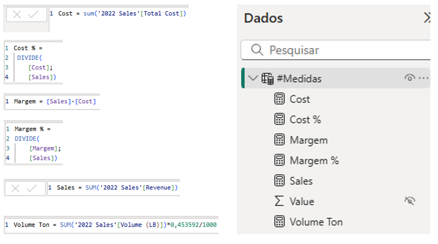
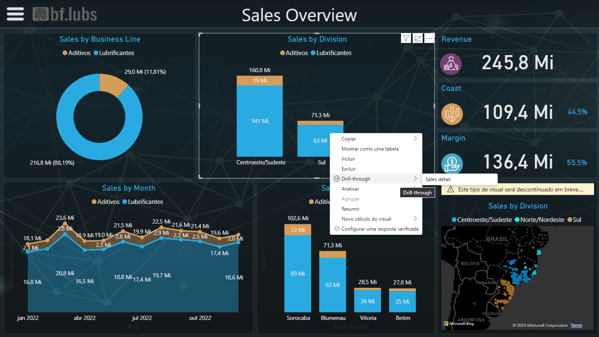
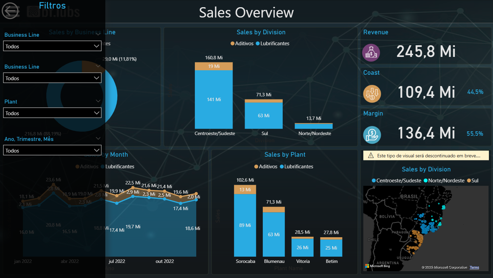

# 📊 Projeto Power BI – Sales Overview

---

## 🧠 Sobre o Projeto
Esse projeto é parte do meu aprendizado desenvolvido ao longo do meu curso de SQL.
O **Sales Overview** é um dashboard desenvolvido em **Power BI** com o objetivo de analisar o desempenho de vendas por **região e planta**, levando em conta coordenadas de **latitude e longitude** e segmentações por **Business Line**, como **aditivos e lubrificantes**.

O projeto consolida dados de vendas e custos, oferecendo uma visão estratégica sobre a performance comercial, permitindo identificar **tendências regionais**, **margens de lucro** e **oportunidades de otimização**.

  

---

## 🚀 Objetivo Principal
Analisar as **vendas por região e planta**, explorando diferentes níveis de detalhe e interatividade, como **tooltips**, **drill-throughs** e **filtros dinâmicos** para facilitar insights sobre o negócio.

---

## 📈 Principais Métricas e KPIs
- 💰 **Receita Total**
- 📉 **Custo Total**
- 📊 **Lucro (%)**
- 💹 **Margem (%)**
- 🔢 **Vendas Mensais**
- 🧾 **Análise de Margem e Rentabilidade por Linha de Negócio**

---

## 🛠️ Tecnologias Utilizadas
- 🟡 **Power BI Desktop**
- 🧩 **Power Query** (ETL – Extração e Transformação de Dados)
- 🔢 **DAX** (Data Analysis Expressions) para medidas e KPIs
- 📈 **Power BI Service** (publicação e compartilhamento)
- 📊 **Excel / CSV** como fonte de dados

---

## 🧩 Etapas do Projeto

### 1️⃣ **Transformação de Dados – Power Query**
Modelagem, tratamento e limpeza das tabelas antes da carga no modelo. Aqui foi realizado a importação dos dados para o power bi seguido da organização e padronização dos tipos de dados (texto, decimal, datas, longitudo e latitude), um processo muito importante antes de iniciarmos a contrução dos nosso gráficos.

  

---

### 2️⃣ **Criação de Medidas – DAX**
Construção das principais medidas de desempenho e KPIs. Nesse projeto, algumas medidas foram criadas utilizando DAX para que possamos obter os resultados de custo, custo percentual, margem, margem percentual, total de vendas e volume de vendas em tonelada.

  

---

### 3️⃣ **Página Inicial do Dashboard**
Resumo executivo com KPIs e visão geral das vendas. Apos a modelagem dos dados utilizando o power query e a contrução das principais medidas em DAX, podemos iniciar a contrução do nosso Dashboard.

  

---

### 4️⃣ **Tool Tip Personalizado**
Exibe detalhes dinâmicos ao passar o mouse sobre os gráficos. Foi utilizado essa ferramente do power bi que é muito útil quando precisamos ver informações de forma rápida só passando o mouse em cima de cada bloco de informação, isso ajuda o gestor a responder perguntas chaves sem precisar navegar entre páginas.

  

---

### 5️⃣ **Drill-through**
Permite navegar para outra página que contem informações detalhadas de cada venda, é uma ferramente muito útil quando é necessário consultar dados detalhados de um segmento expecífico.

  

  

---

### 6️⃣ **Filtros e Segmentações**
Filtros interativos que permitem refinar as análises conforme o segmento, divisão, planta e período (Quartil, Ano e Mês).

  

  

  

## 🔗 Acesso ao Dashboard Online
Você pode visualizar o relatório completo no Power BI Service:  
👉 [**Acessar Dashboard Interativo**](https://app.powerbi.com/view?r=eyJrIjoiYjI5Y2E4Y2MtNzkwMy00YjFiLWFmYTYtOGFlYjZlM2E4YmM2IiwidCI6IjY1OWNlMmI4LTA3MTQtNDE5OC04YzM4LWRjOWI2MGFhYmI1NyJ9)

---

## 💡 Principais Insights
- 🌎 A região com maior receita é o **Sul**, concentrando mais de 40% do total.
- 🏙️ As cidades com melhor performance apresentam maior margem percentual.
- ⚙️ **Lubrificantes** têm margem superior à de **aditivos** em quase todas as regiões.
- 📆 A receita apresentou **crescimento consistente mês a mês**, indicando boa tendência de mercado.

---

## 👨‍💻 Autor
**Kaique Vieira**  
📍 Analista de Dados | Power BI | SQL | Excel | DAX  

🔗 [LinkedIn](https://www.linkedin.com/in/kaique-viei)  
🐙 [GitHub](https://github.com/kahhhexe)

---

⭐ Se este projeto te inspirou, **deixe uma estrela no repositório** para apoiar o trabalho!

